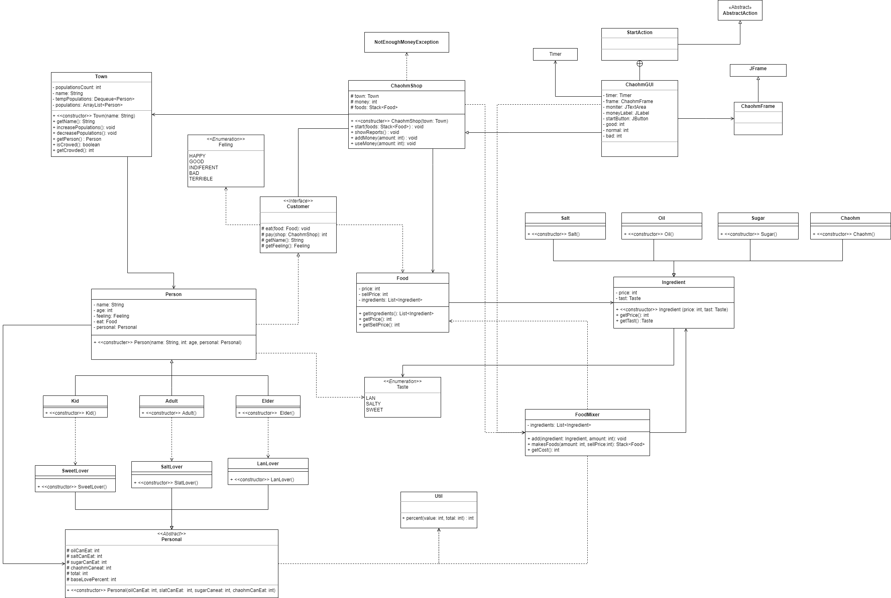

# ChaohmShop
<<<<<<< HEAD
[UMl Link](https://viewer.diagrams.net/js/viewer-static.min.js)
=======
this is a project from OODP subject of the MFU

## Description
This project is about the game that will serve the food to the persons which is a customer
that are in the town and your role is a manager who have to manage the ingredients of the foods
to serve to the customer in the positive way. For this game we have important logics that 
if your customer is feel bad the persons in the town will be decrease and if customer is feel good
the town will be increase persons too. Happy!

## UML ClassDiagram

>>>>>>> 6688588 (Yeah!!)
